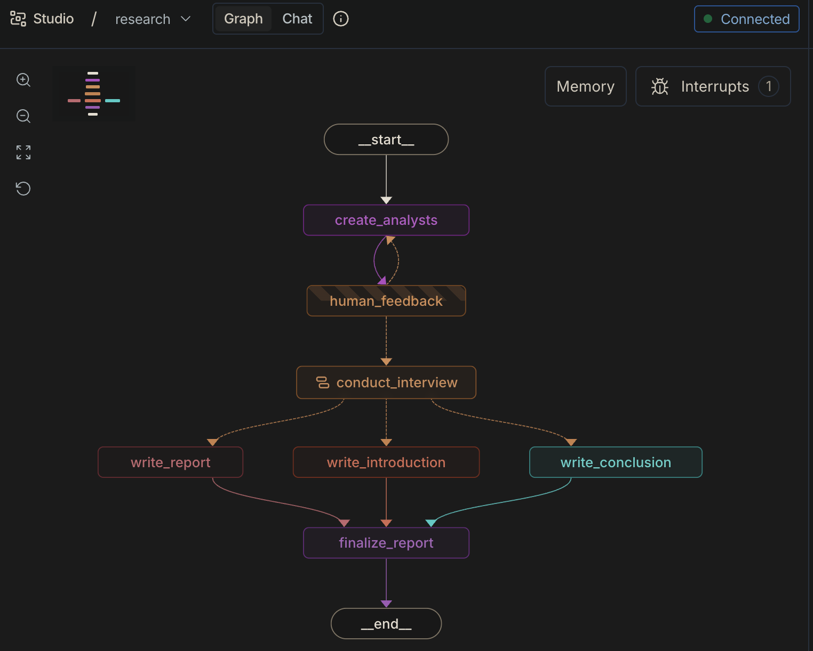
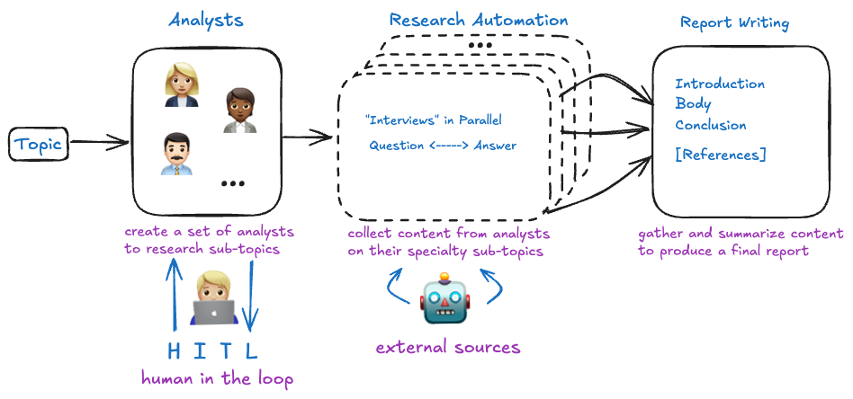

# langgraph-researcher

A multi-analyst research pipeline built on [LangGraph](https://langchain-ai.github.io/langgraph/). Given a topic, the pipeline generates a panel of analyst personas, runs parallel interviews between each analyst and a synthetic "expert" grounded in live web + Wikipedia retrieval, then stitches the per-analyst memos into a single report with introduction, body, and conclusion.



## Credits / Inspiration

The design is adapted from the `4-research-assistant` notebook in LangChain Academy's [Intro to LangGraph](https://academy.langchain.com/courses/take/intro-to-langgraph/) course. The notebook is great for learning the ideas; the code here is a reorganization aimed at being runnable as an installable package, a CLI, a LangGraph Studio app, and a library — all from the same graph definition.

Key differences vs. the notebook:

- **Layered modules** instead of one cell-ordered notebook: prompts, schemas, state, chains (LLM calls), nodes (graph handlers), graph (topology), driver (HITL loop + CLI).
- **Single graph, three run modes.** `build_research_graph()` takes an optional `checkpointer`. Studio injects its own, the CLI driver uses `InMemorySaver`, and production callers can pass `SqliteSaver` / `PostgresSaver` — see [graph.py](research_pipeline/graph.py).
- **Driver-level HITL loop.** The graph is compiled with `interrupt_before=['human_feedback']`; the [driver.py](research_pipeline/driver.py) wraps the resume / re-run cycle so callers just pass a `feedback_fn`.
- **A couple of small fixes** to the original code, called out inline in [nodes.py](research_pipeline/nodes.py#L83-L90) (`str.strip` misuse, bare `except`).



## Architecture

Two graphs compose into one pipeline:

### Parent graph — `build_research_graph`

```
START
  → create_analysts          # LLM generates N analyst personas
  → human_feedback           # INTERRUPT: caller approves or revises
      └─[not "approve"]→ create_analysts (loop with feedback)
      └─["approve"]→ Send() fan-out → conduct_interview (one per analyst)
  → [write_report, write_introduction, write_conclusion]   # parallel
  → finalize_report          # stitch intro + body + conclusion
END
```

The fan-out uses LangGraph's [`Send`](https://langchain-ai.github.io/langgraph/concepts/low_level/#send) API so each analyst runs the interview subgraph in parallel with its own state. Per-analyst memos fan back in via an `Annotated[list, operator.add]` reducer on `sections` — see [state.py](research_pipeline/state.py).

### Interview subgraph — `build_interview_graph`

```
START
  → ask_question                             # analyst asks
  → [search_web, search_wikipedia]           # parallel retrieval
  → answer_question                          # "expert" answers from context only
      └─[turns < max]→ ask_question (loop)
      └─[turns hit max OR sign-off]→ save_interview
  → write_section                            # one memo per analyst
END
```

Retrieval context fans in on `context` via the same `operator.add` reducer pattern. Turn counting and sign-off detection live in `route_messages` in [nodes.py](research_pipeline/nodes.py#L120-L143).

## State design

Three TypedDicts in [state.py](research_pipeline/state.py):

| State | Scope | Fan-in reducers |
|---|---|---|
| `GenerateAnalystsState` | analyst-generation loop | — |
| `InterviewState` (subclasses `MessagesState`) | single analyst interview | `context` |
| `ResearchGraphState` | parent pipeline | `sections` |

Everything else is replaced per node (LangGraph's default behaviour for `TypedDict` fields without an `Annotated` reducer).

## Module map

| File | Responsibility |
|---|---|
| [graph.py](research_pipeline/graph.py) | Graph topology; parent + interview subgraph wiring; checkpointer strategy |
| [nodes.py](research_pipeline/nodes.py) | Thin node handlers + conditional routers (`route_messages`, `initiate_all_interviews`) |
| [chains.py](research_pipeline/chains.py) | LLM calls and retrieval (Tavily, Wikipedia); all prompt-building lives here |
| [prompts.py](research_pipeline/prompts.py) | Prompt templates (analyst, search, question, answer, section, report, bookend) |
| [schemas.py](research_pipeline/schemas.py) | Pydantic models for structured output (`Analyst`, `Perspectives`, `SearchQuery`) |
| [state.py](research_pipeline/state.py) | `TypedDict` state shapes + reducer annotations |
| [llm.py](research_pipeline/llm.py) | Task-specific `ChatAnthropic` factories (`structured` / `interviewer` / `writer`) |
| [driver.py](research_pipeline/driver.py) | HITL resume loop + `argparse` CLI entry point |
| [observability.py](research_pipeline/observability.py) | `@traced` decorator hook |

## How to Run

```bash
# setup in project-dir
cd {project-dir}/
cp .env.example .env       # then fill in your keys (ANTHROPIC_API_KEY, TAVILY_API_KEY)
pip install -e ".[cli]"    # installs the package + langgraph-cli

# Studio
langgraph dev              # opens Studio in your browser

# CLI
langgraph-researcher "LangGraph vs Temporal for agentic workflows" -n 4 -o report.md
# or: python -m research_pipeline "..." -n 4 -o report.md

# Programmatic
python -c "
from research_pipeline import run_research
print(run_research('LangGraph vs Temporal', max_analysts=4))
"
```

### CLI flags

| Flag | Default | Description |
|---|---|---|
| `topic` (positional) | — | Research topic |
| `-n`, `--max-analysts` | `3` | Number of analyst personas |
| `--interactive` | off | Prompt for analyst feedback on stderr; off = auto-approve |
| `-o`, `--output` | stdout | Write the final report to this file |
| `--thread-id` | random UUID | Resume an existing checkpointed thread |
| `-v`, `--verbose` | off | `INFO`-level tracing to stderr |

### Human-in-the-loop from code

```python
from research_pipeline import run_research

def review(analysts):
    for a in analysts:
        print(a.name, a.role)
    return input("feedback or 'approve': ") or "approve"

report = run_research(
    "Rust vs Zig for embedded",
    max_analysts=4,
    feedback_fn=review,          # called once per feedback round
    max_feedback_rounds=5,       # before RuntimeError
)
```

## Sample Report

Below is a sample report generated by the pipeline for the topic "LangGraph vs Temporal for agentic workflows":

# LangGraph vs. Temporal: Choosing the Right Orchestration Engine for Production Agentic AI

## Introduction

As AI agents move from prototype to production, orchestration has become one of the most consequential architectural decisions engineering teams face. This report examines two leading frameworks — **LangGraph** and **Temporal** — across three critical dimensions: their fundamental mental models and developer experience, their approaches to fault tolerance and durable execution, and their strategic fit for enterprise-scale deployments. What emerges is a nuanced picture: these tools are less direct competitors than complementary layers, each excelling where the other shows friction. Understanding that distinction is essential for teams building reliable, long-running agentic systems.

---

As engineering teams build production-grade multi-agent systems, the choice of orchestration framework has become a foundational architectural decision. Two approaches have emerged as leading contenders: **LangGraph**, a graph-based framework purpose-built for LLM workflows, and **Temporal**, a battle-tested durable execution engine now being adapted for agentic AI use cases. What makes this comparison particularly compelling is that the two tools reflect fundamentally different mental models for how developers should think about agent coordination — and increasingly, practitioners are discovering they are complements rather than competitors.

LangGraph is designed from the ground up for LLM and multi-agent interactions, offering stateful, memory-aware orchestration that handles the non-linear, probabilistic nature of AI workflows [1]. Its graph-based paradigm allows teams to visually reason about agent loops — coordinating researcher, planner, and executor agents on shared tasks — and its visual debugging tools are cited as a meaningful boost to developer experience [2][3]. For teams prototyping quickly and iterating on agent behavior, this structured, LLM-first design lowers the conceptual barrier to getting something working. However, LangGraph's checkpointing, while powerful for short-to-medium workflows, lacks the industrial-strength durability guarantees needed for processes that must survive arbitrary infrastructure failures over days or weeks [4].

This is precisely where Temporal's value proposition becomes compelling. Temporal workflows are designed for extreme durability — a workflow function can run for months and survive server crashes, power failures, and infrastructure disruptions without losing state [4]. Temporal fills the durability gap with at-least-once activity execution, automatic retries, and event-sourced workflow history that enables precise replay after failure [4]. For engineering teams building agents that must handle long-running, fault-sensitive tasks, this reliability is difficult to replicate in LangGraph alone.

A particularly notable insight from practitioners is that temporal *reasoning* — the ability of agents to make deliberate timing decisions — is often overlooked until systems begin failing SLA commitments in production. Retrieval agents may perform flawlessly in demos but collapse when required to coordinate across hours, await external approvals, or manage downstream dependencies [5]. LangGraph's architecture can accommodate this complexity, but it requires explicit modeling of time as a first-class concern [5].

The most significant emerging pattern is that sophisticated organizations are adopting both tools in complementary roles rather than making a binary choice. Real-world production architectures, such as the "Fred" platform, combine LangGraph-based agents for reasoning and planning logic with Temporal-powered execution for long-running, failure-prone tasks [6]. In this hybrid model, agent logic remains completely decoupled from retry handling and workflow scheduling — there are no Temporal imports inside the agent code itself. Temporal handles durability transparently at the infrastructure layer, while LangGraph handles the cognitive structure of the agent [6]. For large-scale LLM pipelines — such as processing 10,000-item batches — combining LangGraph's checkpointing capabilities with Temporal's execution guarantees via webhooks represents another emerging hybrid pattern [4].

The Temporal community has been actively wrestling with this boundary, with developer discussions examining whether Temporal workflows can match the expressive power of LangGraph-style agent frameworks [7]. A notable thread explicitly searches for "the best abstraction for LLM-driven Temporal applications with the simplest possible DX," signaling that Temporal's community recognizes a developer ergonomics gap it needs to close [7]. This suggests that while Temporal excels at infrastructure-layer durability, LangGraph currently holds an advantage in developer onboarding and AI-native expressiveness.

For enterprise architecture teams evaluating long-term AI roadmaps, the core tradeoff is clear: LangGraph offers tighter integration with the LLM ecosystem, faster iteration cycles, and a lower conceptual barrier for AI-native teams, while Temporal provides stronger guarantees for mission-critical workflows where failure recovery and auditability are non-negotiable [8][2]. The decision ultimately hinges on the trajectory of an organization's agentic ambitions — particularly as agents evolve from task automation toward autonomous, collaborative systems operating over extended time horizons [9]. The emerging best practice is to let LangGraph plan and reason, and let Temporal execute and endure.


---

## Conclusion

The LangGraph vs. Temporal debate ultimately resolves not as a competition, but as a complementary architectural pairing. LangGraph excels at AI-native expressiveness — structuring multi-agent reasoning loops with intuitive, graph-based orchestration and faster developer onboarding. Temporal delivers where production demands are unforgiving — guaranteeing durable, fault-tolerant execution across long-running, failure-sensitive workflows. Enterprise teams should resist framing this as a binary choice. The emerging best practice is a hybrid model: LangGraph for cognitive structure, Temporal for execution resilience. As agentic systems grow more autonomous and mission-critical, getting this architectural foundation right becomes a decisive competitive advantage.

## Sources
[1] https://www.linkedin.com/posts/alexskuznetsov_temporal-langgraph-agenticai-activity-7370176563192967168-aHQr
[2] https://medium.com/@adeelmukhtar051/navigating-the-future-of-agentic-ai-a-deep-dive-into-langgraph-langchain-crewai-and-autogen-e32c69ff83d8
[3] https://medium.com/data-science-collective/langgraph-vs-temporal-for-ai-agents-durable-execution-architecture-beyond-for-loops-a1f640d35f02
[4] https://medium.com/data-science-collective/langgraph-vs-temporal-for-ai-agents-durable-execution-architecture-beyond-for-loops-a1f640d35f02
[5] https://www.auxiliobits.com/blog/temporal-planning-in-langgraph-workflows-for-time-sensitive-agents/
[6] https://fredk8.dev/blog/durable-ai-agents-orchestrating-the-future-with-fred-and-temporal/
[7] https://community.temporal.io/t/agentic-ai-lang-graph-vs-temporal-workflows/18371
[8] https://www.linkedin.com/posts/leonidganeline_temporal-vs-langgraph-for-long-running-ai-activity-7388058096713097217-35Tc
[9] https://www.facebook.com/groups/aiautomationagency.aaa/posts/1464982617961816/
```
